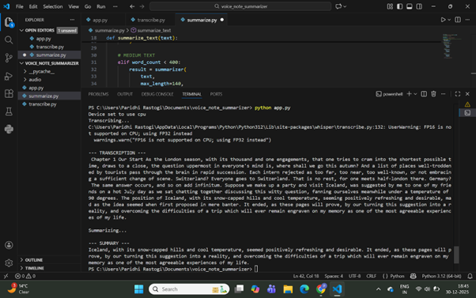
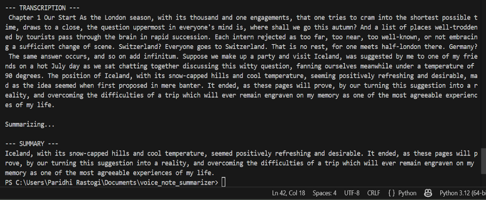

# Voice Note Summarizer

A Python-based tool that transcribes spoken audio and generates concise text summaries using modern speech recognition and transformer-based language models.

This project demonstrates an **end-to-end pipeline** for converting voice notes into readable summaries, with a focus on **reliability, clean output, and engineering trade-offs** rather than raw model novelty.

---

## Features
- Converts audio files (`.mp3`, `.wav`) to text using OpenAI Whisper
- Summarizes transcribed text using transformer-based language models
- Handles narrative and long-form audio
- Automatically trims incomplete trailing sentences from transcriptions
- Adapts summarization strategy based on input length
- Runs entirely on CPU (no GPU required)

---

## Tech Stack
- **Python**
- **OpenAI Whisper** – Speech-to-Text
- **Hugging Face Transformers**
- **facebook/bart-large-cnn** – Text Summarization
- **FFmpeg** – Audio processing

---

## Project Structure
```
voice-note-summarizer/
├── app.py # Main entry point
├── transcribe.py # Audio → text transcription + cleanup
├── summarize.py # Text summarization logic
├── requirements.txt # Dependencies
├── README.md
├── audio/
│ └── sample.mp3 # Example audio file
└── screenshots/
├── bart_summary.png
└── t5_hallucination.png
```
---

##  How to Run

### 1. Install dependencies
```bash
pip install -r requirements.txt
```
### 2. Run the application
```
python app.py
```


### The program will:
- Transcribe the audio file
- Clean the transcription by removing incomplete trailing sentences
- Generate a concise summary


### Sample Output
Transcription and Summary (BART – Final Model)




Hallucination Example (T5 – Rejected)


###  Model Experiments & Design Decisions

During development, multiple transformer-based summarization models were evaluated on narrative audio transcriptions.

Length-Aware Summarization

The summarization strategy adapts based on transcription length:

Short inputs do not benefit from aggressive compression and are summarized with tighter constraints.

Longer inputs require stronger length constraints to maintain coherence while reducing verbosity.

This avoids over-summarizing short content while still producing concise summaries for long-form audio.

Model Behavior Observations

Summarization models tend to abstract examples and named entities unless explicitly constrained.

Preserving factual details (such as place names) requires careful parameter selection and conservative generation.

Parameter Trade-offs

max_length encourages controlled compression and more faithful summaries.

max_new_tokens encourages abstraction and generation, which may introduce hallucinations in narrative text.

Final Model Selection

facebook/bart-large-cnn was selected for the final implementation due to its reliable and faithful summaries.

t5-base was evaluated but rejected after observing hallucination of non-existent entities in narrative summaries.

The final design prioritizes correctness and trustworthiness over overly abstract summaries.

###  Use Cases

Lecture note summarization

Meeting summaries

Voice memos

Audiobook-style narration